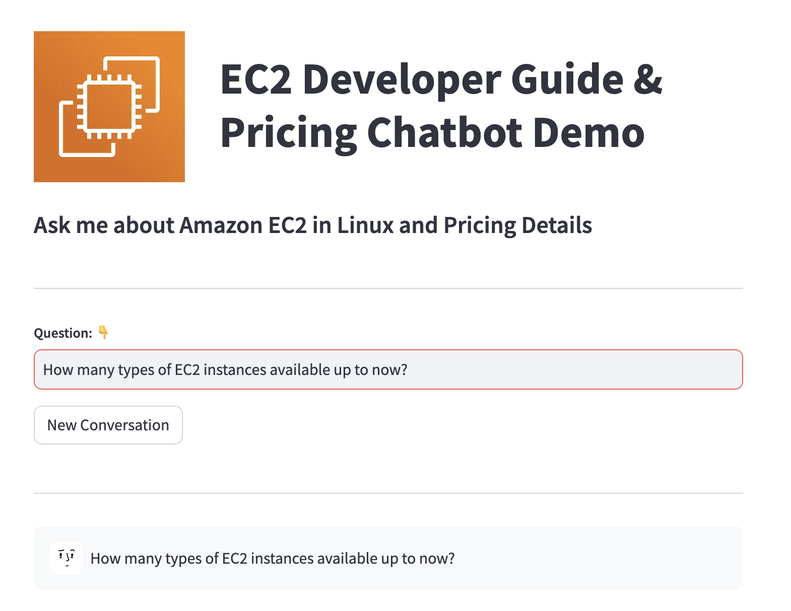

# Streamlit Frontend UI Application

## Introduction

This application is a simple UI for the chatbot powered by Amazon Bedrock Agent.
This application is deployed in Amazon ECS, AWS Fargate. There is one Application Load Balancer associated with it.

## Component Details

#### Prerequisites

- All resources defined in the code stack deployed successfully

#### Technology stack

- [Amazon ECS](https://aws.amazon.com/ecs/)
- [Application Load Balancer](https://aws.amazon.com/elasticloadbalancing/application-load-balancer/)

#### Package Details

| Files                                | Description                                                                                                |
| ------------------------------------ | ---------------------------------------------------------------------------------------------------------- |
| [app.py](app.py)                     | Python file is the entry point the of streamlit application                                                |
| [connections.py](connections.py)     | Python file with `Connections` class for establishing connections with external dependencies of the lambda |
| [utils.py](utils.py)                 | Python file containing helper functions to be used in the application                                      |
| [Dockerfile](Dockerfile)             | Dockerfile to build image for streamlit application deployment service                                     |
| [requirements.txt](requirements.txt) | requirements.txt file used to build the docker image                                                       |

#### Environmental Variables

| Field                  | Description                                                        | Data Type |
| ---------------------- | ------------------------------------------------------------------ | --------- |
| `AGENT_ID`             | Set the Amazon Bedrock Agent id                                    | String    |
| `LAMBDA_FUNCTION_NAME` | Set the lambda function name that invokes the Amazon Bedrock Agent | String    |
| `LOG_LEVEL`            | Sets the log level config                                          | String    |

### Run Locally

```bash
streamlit run app.py --server.runOnSave true --server.port 8504
```

### User Interface


